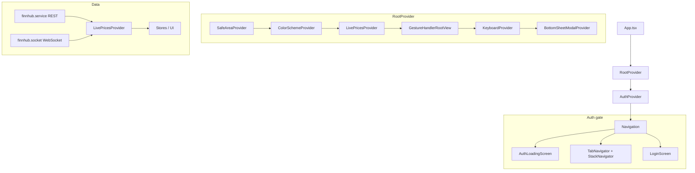

# StockPulse

StockPulse is an Expo / React Native mobile app for tracking stocks: watchlist, live charts, price alerts, and settings. It uses Auth0 for authentication (custom sign-in) and Finnhub for market data (REST + WebSocket). Local persistence is handled with MMKV.

## Prerequisites

- **Node.js** (LTS) or **Bun**
- **Expo CLI** (optional; `npx expo` or `bunx expo` works)
- **iOS**: Xcode and CocoaPods
- **Android**: Android Studio and SDK

## Quick start

```bash
# Install dependencies
bun install

# Copy environment file and fill in values (see Environment configuration)
cp .env.example .env

# Start development server
bun start

# Run on device/simulator
bun run ios
bun run android
```

Other scripts (from `package.json`): `bun run lint`, `bun run format`, `bun run test`, `bun run web`.

---

## Environment configuration

All runtime configuration is done via environment variables. Expo only exposes variables prefixed with `EXPO_PUBLIC_`.

1. Copy the example file:

   ```bash
   cp .env.example .env
   ```

2. Fill in the values in `.env`. Never commit `.env`; it is gitignored.

| Variable | Description |
| -------- | ----------- |
| `EXPO_PUBLIC_AUTH0_DOMAIN` | Auth0 tenant domain (e.g. `your-tenant.auth0.com`) |
| `EXPO_PUBLIC_AUTH0_CLIENT_ID` | Auth0 application client ID |
| `EXPO_PUBLIC_AUTH0_CUSTOM_SCHEME` | Deep link scheme for Auth0 callback. Must match the `scheme` in `app.json` and the scheme configured in your Auth0 application (e.g. `auth0stockpulse`) |
| `EXPO_PUBLIC_FINNHUB_TOKEN` | Finnhub API token for quotes and symbol search |

These are read in [src/utils/constant.utils.ts](src/utils/constant.utils.ts). The `react-native-auth0` plugin in [app.json](app.json) also uses `EXPO_PUBLIC_AUTH0_DOMAIN` and `EXPO_PUBLIC_AUTH0_CUSTOM_SCHEME` for native configuration.

---

## Folder structure

```text
StockPulse/
├── App.tsx
├── app.json
├── eas.json
├── metro.config.cjs
├── babel.config.js
├── jest.config.js
├── prettier.config.js
├── .env.example
├── __tests__/
│   ├── setup.tsx
│   ├── mocks/
│   │   └── react-native-gifted-charts.ts
│   ├── modules/
│   │   ├── alerts/
│   │   │   ├── screens/
│   │   │   │   ├── AlertsScreen.test.tsx
│   │   │   │   └── CreateAlertScreen.test.tsx
│   │   │   └── utils/
│   │   │       └── alert.utils.test.ts
│   │   ├── charts/
│   │   │   └── screens/
│   │   │       └── ChartsScreen.test.tsx
│   │   ├── home/
│   │   │   └── screens/
│   │   │       └── HomeScreen.test.tsx
│   │   ├── login/
│   │   │   └── screens/
│   │   │       └── LoginScreen.test.tsx
│   │   └── settings/
│   │       └── SettingsScreen.test.tsx
│   └── store/
│       ├── alerts.store.test.ts
│       ├── preferences.store.test.ts
│       └── watchlist.store.test.ts
├── src/
│   ├── components/
│   │   ├── bottomSheet/
│   │   ├── buttons/
│   │   ├── cards/
│   │   ├── chips/
│   │   ├── inputs/
│   │   └── ... (AuthLoadingScreen, Header, Icon, Logo, etc.)
│   ├── config/
│   │   ├── notifications.ts
│   │   └── plugins/
│   │       └── mmkv.plugin.ts
│   ├── hooks/
│   │   └── useTheme.tsx
│   ├── languages/
│   │   ├── i18n/
│   │   │   └── index.ts
│   │   └── locales/
│   │       ├── en.ts
│   │       ├── es.ts
│   │       └── index.ts
│   ├── modules/
│   │   ├── alerts/
│   │   │   ├── components/
│   │   │   ├── screens/
│   │   │   │   ├── AlertsScreen.tsx
│   │   │   │   └── CreateAlertScreen.tsx
│   │   │   └── utils/
│   │   ├── charts/
│   │   │   └── screens/
│   │   │       └── ChartsScreen.tsx
│   │   ├── home/
│   │   │   ├── components/
│   │   │   └── screens/
│   │   │       └── HomeScreen.tsx
│   │   ├── login/
│   │   │   └── screens/
│   │   │       └── LoginScreen.tsx
│   │   └── settings/
│   │       └── SettingsScreen.tsx
│   ├── navigation/
│   │   ├── index.tsx
│   │   ├── stack-navigator.tsx
│   │   └── tab-navigator.tsx
│   ├── providers/
│   │   └── index.provider.tsx
│   ├── services/
│   │   ├── finnhub.service.ts
│   │   └── finnhub.socket.ts
│   ├── store/
│   │   ├── auth.context.tsx
│   │   ├── alerts.store.ts
│   │   ├── live-prices.context.tsx
│   │   ├── live-prices.refs.ts
│   │   ├── live-prices.types.ts
│   │   ├── preferences.context.tsx
│   │   ├── preferences.store.ts
│   │   ├── store.ts
│   │   └── watchlist.store.ts
│   └── utils/
│       ├── constant.utils.ts
│       ├── flags.utils.ts
│       ├── styles.utils.ts
│       └── theme.utils.ts
├── assets/
│   ├── icons/
│   └── ...
├── types/
│   └── global/
│       └── declaration.d.ts
└── .agents/
    └── skills/
        └── auth0-react-native/
```

---

## Resources and links

### UI

- **Stitch (Google)** – [https://stitch.withgoogle.com/](https://stitch.withgoogle.com/)
- **Figma prototype** – [StockPulse Design](https://www.figma.com/proto/VfGTpZ0tC5gFExqi1uvDcd/StockPulse---Design?node-id=26-969&t=6qjevU1qG3RSZ3L0-1)

### Auth

- **Auth0** – Implemented with custom sign-in using [react-native-auth0](https://github.com/auth0/react-native-auth0). The app wraps the root in [AuthProvider](src/store/auth.context.tsx) (custom scheme, `authorize` / `clearSession`, sign-in/sign-up via `screen_hint`). See [Auth0 React Native docs](https://auth0.com/docs/quickstart/native/react-native) and your Auth0 dashboard for tenant and application settings.

### Storage

- **Local**: **MMKV** via [src/config/plugins/mmkv.plugin.ts](src/config/plugins/mmkv.plugin.ts) – used by watchlist, alerts, and preferences stores.
- **Cloud (reference)**: **Cloudinary** – [https://cloudinary.com/](https://cloudinary.com/) – not implemented in the codebase; use for media/asset hosting if needed.

---

## Implementation summary

| Area | Implementation |
| ---- | -------------- |
| **Auth** | [AuthProvider](src/store/auth.context.tsx) wraps the app; uses `Auth0Provider` and `useAuth0`. Session restored via `hasValidCredentials()`. Sign-out clears watchlist and alerts stores. |
| **Navigation** | [src/navigation/index.tsx](src/navigation/index.tsx): static navigation with `useIsSignedIn` / `useIsSignedOut`. Tabs: Home, Charts, Alerts, Settings. Stack: CreateAlert. |
| **State** | Zustand stores in [src/store/](src/store/) (watchlist, alerts, preferences) with MMKV persistence. [LivePricesProvider](src/store/live-prices.context.tsx) for real-time quotes and alert evaluation. |
| **Data** | UI never talks to `axios` or raw sockets directly. Screens and components consume data via [finnhub.service.ts](src/services/finnhub.service.ts) (REST helpers like `getQuote`, `getSymbolDescriptions`, `searchSymbolsRemote`) and the hooks/utilities exposed by [LivePricesProvider](src/store/live-prices.context.tsx) (e.g. `useQuotesForSymbols`, `usePriceHistoryForSymbols`, `useSetExtraSymbols`). Finnhub token comes from env. |
| **i18n** | [src/languages/i18n/index.ts](src/languages/i18n/index.ts): i18next; locale from MMKV or device. Locales in [src/languages/locales/](src/languages/locales/) (en, es). |
---

## Services and data access

- **Finnhub REST (`finnhub.service.ts`)**
  - Use exported helpers such as `getQuote(symbol)`, `getSymbolDescriptions(symbols)`, and `searchSymbolsRemote(query, exchange?)` from `src/services/finnhub.service.ts`.
  - Examples: `HomeScreen` and `ChartsScreen` resolve watchlist symbols to company names via `getSymbolDescriptions`, and `CreateAlertScreen` uses `searchSymbolsRemote` and `getQuote` for symbol search and current price.
  - **Guideline**: do **not** call Finnhub endpoints or create new `axios` clients directly in screens; add or reuse helpers in `finnhub.service.ts` instead (centralizes caching, pagination, and error handling).

- **Live prices and WebSocket (`LivePricesProvider`)**
  - For real-time data, use the hooks/utilities exported from `src/store/live-prices.context.tsx` / `live-prices.refs.ts`, for example:
    - `useQuotesForSymbols(symbols: string[])` – latest quotes per symbol (watchlist, alerts list, etc.).
    - `usePriceHistoryForSymbols(symbols: string[])` – history series for charts.
    - `useSetExtraSymbols()` – register extra symbols that should receive live updates even if they are not yet in the persistent watchlist (e.g. the symbol currently edited in `CreateAlertScreen`).
  - **Guideline**: do **not** subscribe/unsubscribe to the WebSocket manually from UI. `LivePricesProvider` manages `finnhub.socket`; UI should only declare which symbols it cares about and read data via these hooks.

This pattern keeps networking, caching, and socket management centralized so UI code remains declarative and easier to test.

---

## TODOs

- [ ] **Monitoring**: Sentry
- [ ] **Commit lint**: Husky
- [ ] **Import sorting**: `@trivago/prettier-plugin-sort-imports`
- [ ] **Husky** (optional, senior-level)
- [ ] **lint-staged**
- [ ] **Offline support**: Latest data when user closes the app and does not restore connection
- [ ] **EAS Update**: Set up EAS Update for over-the-air updates to deliver new features and bug fixes without a full app store release.

---

## Architecture and data flow



- **App entry** ([App.tsx](App.tsx)): `RootProvider` → `AuthProvider` → `AppNavigation`. If auth is loading, `AuthLoadingScreen` is shown; otherwise the static navigator decides between signed-in (tabs + stack) and signed-out (Login).
- **RootProvider** ([src/providers/index.provider.tsx](src/providers/index.provider.tsx)): Loads fonts, locks orientation to portrait, requests notification permissions, and wraps children in SafeArea, ColorScheme, LivePrices, GestureHandler, Keyboard, and BottomSheet providers.
- **Data**: Finnhub REST for quotes and symbol search; WebSocket for live prices. `LivePricesProvider` subscribes by watchlist symbols, updates refs, evaluates alerts, and exposes `useQuotesForSymbols` / `usePriceHistoryForSymbols` to the UI.

---

## State and persistence

- **Stores (Zustand + MMKV)**  
  - **watchlist.store**: List of symbols; key `watchlist_symbols`.  
  - **alerts.store**: Alerts (symbol, threshold, direction, enabled); key `alerts_list`.  
  - **preferences.store**: Language and color scheme; keys `language`, `colorScheme`.  
  All persist via [src/config/plugins/mmkv.plugin.ts](src/config/plugins/mmkv.plugin.ts) (single MMKV instance `id: 'stockpulse'`).

- **Contexts**  
  - **Auth**: Session, `signIn` / `signOut`, error handling.  
  - **ColorScheme**: Theme (light/dark) from preferences.  
  - **LivePrices**: Subscribes to Finnhub WebSocket for watchlist symbols; keeps last quote and history in refs ([live-prices.refs.ts](src/store/live-prices.refs.ts)); runs alert checks and local notifications.

- **Live prices**  
  Refs hold the latest quote and history per symbol. The context subscribes to the socket and updates these refs; components use `useQuotesForSymbols` and `usePriceHistoryForSymbols` to read and re-render on updates.

---

## Testing

- **Stack**: Jest with React Native Testing Library; [`__tests__/setup.tsx`](__tests__/setup.tsx) sets up providers and mocks; [jest.config.js](jest.config.js) configures path aliases (e.g. `@/`).
- **Tests**: Under `__tests__/` for screens (Home, Charts, Alerts, CreateAlert, Login, Settings), stores (alerts, preferences, watchlist), and utils (e.g. alert.utils). Mocks live in `__tests__/mocks/` (e.g. [react-native-gifted-charts.ts](__tests__/mocks/react-native-gifted-charts.ts)).
- Run: `bun run test` (watch mode).
